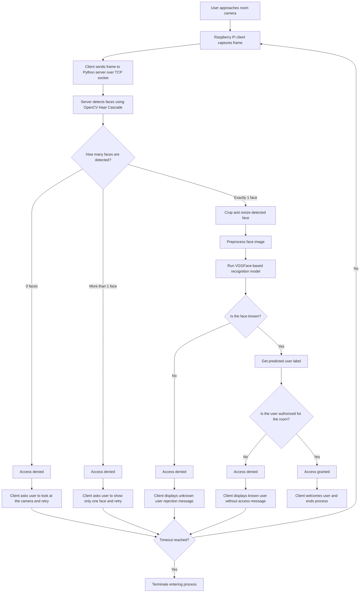

# 🚪 Face Recognition-Based Room Access System


> A face recognition-based room access prototype built with Python, OpenCV, Keras, and Raspberry Pi.

## 📌 Overview

This project is a face recognition-based room access system built with Python, OpenCV, Keras, and Raspberry Pi.

A Raspberry Pi client captures live camera frames and sends them to a Python server over a TCP socket connection. The server detects faces, runs recognition using a custom-trained VGGFace-based model, checks whether the identified user is authorized, and sends the result back to the client.

If no face or multiple faces are detected, access is denied and the user is prompted to retry. If exactly one face is detected, the system processes the face and makes an access decision based on both recognition and room permissions.

The result is a compact end-to-end prototype that combines real-time communication, computer vision, deep learning, and access-control logic.


## ✨ Features

- Real-time face-based room access control
- Client-server architecture for separating camera capture from inference
- Face detection using OpenCV Haar Cascades
- Custom-trained face recognition model built on top of VGGFace
- Authorization layer that checks whether a recognized user has room access
- Explicit handling for:
  - no face detected
  - unknown face
  - known face without access
  - known face with access
  - multiple faces in frame
- Retry flow with timeout protection


## 🏗️ Architecture

```text
[Raspberry Pi Room Client]
  - Captures live camera frames
  - Sends frames to the server over TCP socket
  - Receives access decision messages
  - Displays feedback to the user

            │
            ▼

[Python Server]
  - Receives image frames from the client
  - Detects faces using OpenCV Haar Cascades
    - If no face is detected:
        - denies access
        - sends a retry message to the client
    - If more than one face is detected:
        - denies access
        - sends a retry message asking for only one face
    - If exactly one face is found:
        - crops and preprocesses the face
        - runs recognition using the trained VGGFace-based model
        - checks whether the identified user is authorized
  - Sends the appropriate access result back to the client
```

## 📂 Project Structure

```text
.
├── face-detection-model-creation.py
├── room.py
├── server.py
├── final-face-recognition-model.h5
├── person-labels.pickle
└── TrainingPhotos/
```

## 🔄 Project Flow Diagram



## ⚙️ How It Works

1. The room client starts the Raspberry Pi camera and connects to the server.
2. The client captures frames and sends them to the server through a socket connection.
3. The server receives a frame and detects faces.
4. If **no face** is detected, the server returns a rejection message and the client asks the user to look directly at the camera and retry.
5. If **more than one face** is detected, the server returns a rejection message and the client asks the user to show only one face before retrying.
6. If **exactly one face** is detected, the face is cropped, resized, preprocessed, and passed to the trained recognition model.
7. The prediction result is checked against a threshold to decide whether the face is known or unknown.
8. If the face is unknown, access is denied and the client prompts the user to retry.
9. If the face is known, the server checks whether that user is authorized for the room.
10. If the user is authorized, access is granted. Otherwise, access is denied and the client prompts the user to retry.
11. The process continues until access is granted or the timeout limit is reached.

## ⚙️ Configuration

Before running the project, review these hardcoded values:

- **Server IP** in room.py
  
  Set `server_Ip` to the IP address of the machine running the server.

- **Authorized users** in server.py
  
  Update the room access lists to match the users allowed to enter.

- **Port number**
  
  The client and server both use port `9000`, so change it in both files if needed.

> [!NOTE]
> The model file (`final-face-recognition-model.h5`), label file (`person-labels.pickle`), and training dataset folder (`TrainingPhotos/`) are loaded using relative paths, so keep the expected project structure when running the code.

### 🏷️ Training Data and Labels

The training dataset is expected to be stored inside the `TrainingPhotos/` folder, with one subfolder per person.

Each subfolder name becomes that person’s label during training. This means the folder names you choose are important, because they are used as the class names for the model.

Example structure:

```text
TrainingPhotos/
├── john/
├── mark/
├── david/
└── tom/
```

In this example, the labels generated for the model will be `john`, `mark`, `david`, and `tom`.

> [!NOTE]
> Make sure each person's images are placed inside their own subfolder, because the training pipeline automatically uses the subfolder names as labels.


## 📨 Message Protocol

The server returns a simple two-part message:

| Message | Meaning |
|---|---|
| `0 -1` | No face detected |
| `0 0` | Unknown face |
| `0 <name>` | Known user, but access denied |
| `1 <name>` | Known user, access granted |
| `2 2` | More than one face detected |

This keeps the room-side logic small and easy to debug.

In general:

- messages starting with `0` indicate access denial, with the second field explaining the reason
- messages starting with `1` indicate access granted
- messages starting with `2` indicate access denial because more than one person is visible to the room camera

## 🔍 Highlights

- **Socket-based image streaming** using Python 
- **Face detection before recognition** for cleaner inference
- **Transfer learning with VGGFace** for custom identity recognition
- **Automatic face cropping** during dataset preparation
- **Threshold-based unknown face handling** for safer access decisions

## 🔍 Implementation Details

### 1. Face cropping during dataset preparation 🖼️

The training pipeline automatically scans training images, detects faces, discards invalid samples, crops the detected face, and saves standardized images before fitting the model.

Benefits:

- standardizes the dataset automatically
- improves consistency between training and inference
- reduces manual preprocessing work

### 2. Transfer learning with VGGFace 🧠

The model training script uses a VGGFace backbone and adds a custom dense classification head.

Relevant links:

- [keras-vggface](https://github.com/rcmalli/keras-vggface)
- [Keras Functional API](https://keras.io/guides/functional_api/)
- [Keras Model API](https://keras.io/api/models/model/)

Benefits:

- uses pretrained face features instead of training from scratch
- is well-suited for small custom identity datasets

### 3. Threshold-based unknown user handling 🚫

The project uses a threshold on model scores to decide whether a face should be treated as known.

Relevant docs:

- [Keras activation functions](https://keras.io/api/layers/activations/)
- [Softplus activation](https://keras.io/api/layers/activations/#softplus-function)

Benefits:

- helps avoid forcing every detected face into one of the known classes
- adds a practical unknown-person rejection path
- shows thoughtful handling of a real access-control scenario

### 4. Socket-based frame streaming 📡

The room client streams camera frames directly to the server using Python sockets.

Benefits:

- avoids temporary file-based transfer
- keeps the protocol lightweight
- cleanly separates capture hardware from server-side processing

### 5. Detection before recognition 👤

The server first detects faces using Haar Cascades, then runs recognition only on the cropped face region.

Relevant docs:

- [OpenCV Cascade Classifier](https://docs.opencv.org/3.4/db/d28/tutorial_cascade_classifier.html)

Benefits:

- reduces noise in recognition
- allows explicit handling of zero-face and multi-face cases
- keeps inference input consistent with training


## 🛡️ Security and Edge Cases

> [!IMPORTANT]
> The project explicitly denies access when more than one face is visible in the frame.
> This prevents multiple people from attempting to enter together when only one user may be authorized.

Handled cases include:

- no face visible to the camera
- unknown person attempting access
- known person without permission
- authorized known person
- multiple faces in frame
- repeated failed attempts over time

---

## ⚠️ Limitations

- Hardcoded port
- Hardcoded access list in server code
- Prototype-level configuration
- No database, API layer, or audit logging

## 🚀 Future Improvements

- Move config into environment variables
- Replace hardcoded access lists with a database
- Add logging and audit history
- Integrate with real door lock hardware
- Add tests and packaging

## 📚 Notable Dependencies

### [OpenCV](https://opencv.org/)
Used for face detection, image handling, resizing, and preprocessing.

### [keras-vggface](https://github.com/rcmalli/keras-vggface)
Provides the pretrained VGGFace model used as the base for custom face recognition.

### [Keras](https://keras.io/)
Used for model definition, training, saving, loading, and inference.

---

## 🙏 Acknowledgements

- [OpenCV Cascade Classifier documentation](https://docs.opencv.org/3.4/db/d28/tutorial_cascade_classifier.html)
- [keras-vggface](https://github.com/rcmalli/keras-vggface)
- [Keras documentation](https://keras.io/)
